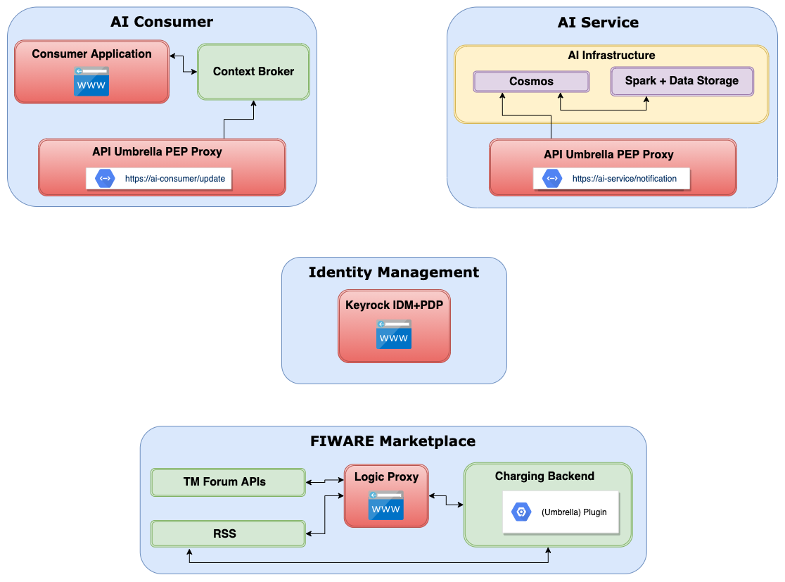

=====================================
Architecture Blueprints
=====================================

.. note::
   This document needs content

What is it about blueprints, asset types and marketplace plugins?

* Introduction to the concept

----------------------------
Blueprints
----------------------------

Architecture blueprints in the AI Marketplace

* Description of "Base Spark on Digital Twins" blueprint, assign PoC architecture components to blueprint

* (Optional) Describe additional blueprint for data provider service

* (Optional) Describe additional blueprint for file data provider service

Base Spark on Digital Twins
*****************************

* Description of the "Base Spark on Digital Twins" blueprint
* Example of predicting weights of animals

Overview of target architecture between AI consumer and AI Service:

.. image:: ./images/blueprints/FW-Marketplace-Consumer-Provider.png
   :align: center

The following describes a simplified target architecture consisting of AI Service, AI Consumer,
FIWARE Marketplace and a central Keyrock IDM instance.

The AI Service consists of the AI infrastructure (Spark environment and Cosmos connector) and an instance
of API Umbrella as PEP proxy. Within API Umbrella, it is assumed that an API Backend is already configured
with endpoint https://ai-service/notification 
pointing to the Cosmos Receiver notification endpoint, and the central Keyrock instance is configured as IDM.

The AI Consumer consists of its application (e.g. some dashboard), some IoT devices (will be simulated in this PoC),
a Context Broker and an instance of API Umbrella as PEP proxy. Within API Umbrella, it is assumed that an
API Backend is already configured with endpoint https://ai-consumer/update
pointing to the Context Broker update endpoint, and the central Keyrock instance
is configured as IDM.

A central Keyrock instance is setup, which handles the identity management for all environments.

The Marketplace consists of its usual components. For this blueprint, a specific plugin is installed within the
charging backend. The plugin has admin access to Keyrock.

   Overview of simplified architecture
	   

Three different processes must be handled by the plugin for this blueprint.

**Product offer creation:**

The AI Service Provider wants to offer its service on the Marketplace. In Keyrock, the provider has an account
"ai-provider" with access to the Marketplace as "Seller". The user "ai-provider" now creates a product for its "AI Service".
When the product is created, the following steps need to be executed:

1. In Keyrock for user "ai-provider" (can be handled **manually by provider** or **by plugin**): 

   * Create App "AI Service" with URL https://ai-service and Password Grant OAuth2 Flow

2. In Keyrock App "AI Service" for user "ai-provider" (can be handled **manually by provider** or **by plugin**): 

   * Create role "ai-service-consumer-notification" 
   * Create permission "AI Service Notification Access" for accessing AI Service notification endpoint (e.g., Action=POST, Resource=notification)
   * Link role and permission

3. In AI Service API Umbrella (handled **manually by provider**):

   * Add Keyrock "AI Service" App OAuth2 ClientID to API Backend configuration

.. figure:: ./images/blueprints/proc1_create-product.png
   :align: center

   Product offer creation

**Acquiring access:**

The consumer finds the AI service on the Marketplace and wants to acquire access. In Keyrock, the consumer has an account 
"ai-consumer" with access to the Marketplace as "Customer". The user "ai-consumer" now acquires access to "AI Service"
via the Marketplace "buy" process. When access is acquired, the following steps need to be executed:

1. In Keyrock (can be handled **manually by provider** or **by plugin**):

   * Authorize user "ai-consumer" for App "AI Service" with role "ai-service-consumer-notification"

2. In Keyrock for user "ai-consumer" (handled **manually by consumer**):

   * Create App "AI Consumer" with URL https://ai-consumer and Password Grant OAuth2 Flow
   * In App "AI Consumer": Create role "ai-consumer-update"
   * In App "AI Consumer": Create permission "AI Consumer Update Access" for accessing AI Consumer Context Broker Update endpoint (e.g., Action=PATCH, Resource=update)
   * In App "AI Consumer": Link role and permission

3. In AI Consumer API Umbrella (handled **manually by consumer**):

   * Add Keyrock "AI Consumer" App OAuth2 ClientID to API Backend configuration
     
4. In Consumer Context Broker (handled **manually by consumer**):

   * Create subscription to endpoint https://ai-service/notification for changes on attribute "weight"

5. In "AI Service" (handled **manually by provider**):

   * Register "AI Consumer" update endpoint https://ai-consumer/update in AI Service Cosmos Connector (OrionSink?!).
     This might require, that the provider deploys a specific container with this endpoint pre-configured.

.. figure:: ./images/blueprints/proc2_acquire-access.png
   :align: center

   Acquiring access
	   

**Consuming AI Service:**

After the consumer has acquired access to the AI Service, it wants to consume the service now and receive
predictions.

The IoT Agents sending weight updates to the Context Broker will be simulated by the dashboard application.

1. IoT Agent updates data (here: weight) in Context Broker (PoC: will be simulated)

   * Access from Iot Agents/dashboard to the Context Broker is not protected here for this PoC, as we assume we are within
     the Consumer infrastructure. Therefore there is no proxy in between.

2. Context Broker notifies AI Service endpoint about value change (here: weight)

   1. Notification send to AI Service API Umbrella PEP Proxy endpoint https://ai-service/notification (POST) with Consumer
      token obtained from Keyrock
   2. AI Service API Umbrella asks Keyrock about permission to access notification endpoint
   3. If ok, AI Service Umbrella PEP Proxy forwards notification to Cosmos Receiver
   4. Prediction process is triggered within Spark environment

3. Prediction results (weight in 10 days, weight end of season) are updated within Context Broker

   1. Result/Updated data send from Cosmos OrionSink to Consumer API Umbrella PEP Proxy "Update" endpoint
      https://ai-consumer/update with AI Service provider token obtained from Keyrock
   2. AI Consumer API Umbrella asks Keyrock about Permission to access "Update" endpoint
   3. If ok, Consumer API Umbrella PEP Proxy forwards "Update" request to Context Broker

The updated prediction results can be viewed on the AI Consumer dashboard application.
      
.. figure:: ./images/blueprints/proc3_consume-service.png
   :align: center

   Consuming AI Service
	  

**Open Questions/Issues:**

* BAE plugins only allow forms for product/offer creation. There is no possibility for the consumer to enter
  data about its own infrastructure/accounts during the acquisition process.

  This results in several steps to be performed manually on the provider and the consumer side.

  1. Especially on the consumer side all steps need to be performed manually, because the plugin does not have
     the necessary information. 
  2. On the provider side, configuration for the consumer "update" endpoint needs to be done manually, since the
     plugin does not have the necessary information. Adding the "AI Service" ClientID to the AI Service API Umbrella
     PEP Proxy could be done automatically, if the provider would enter Admin API Key information during the product
     creation process.

* On the AI Service side, the Cosmos connector needs to be configured where to send the updated predictions to (CosmosSink?).
  Cosmos does not provide an API for configuration. Therefore it might be needed that a specific instance needs to be deployed
  for each consumer that was granted access with the consumer update endpoint (https://ai-consumer/update)
  being pre-configured (e.g. via ENV)

* The plugin needs to perform changes within Keyrock. For this, a specific admin account needs to be created within
  Keyrock. Plugins will need to get these credentials either via
  ENV (Example: https://github.com/Ficodes/bae-ngsild-query/blob/master/keyrock_client.py#L31) or file on the marketplace
  charging backend environment.

* Open: Define process for product/service suspension

* Open: Define processes for usage accounting
  

  
  

---------------------------
Plugin implementation
---------------------------

Information about the plugins to be implemented for the blueprints

