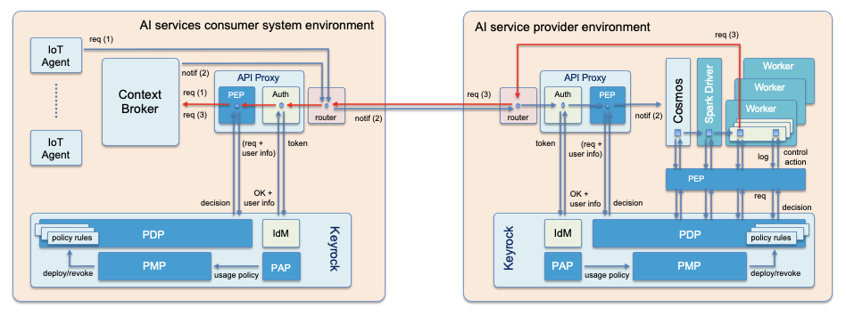
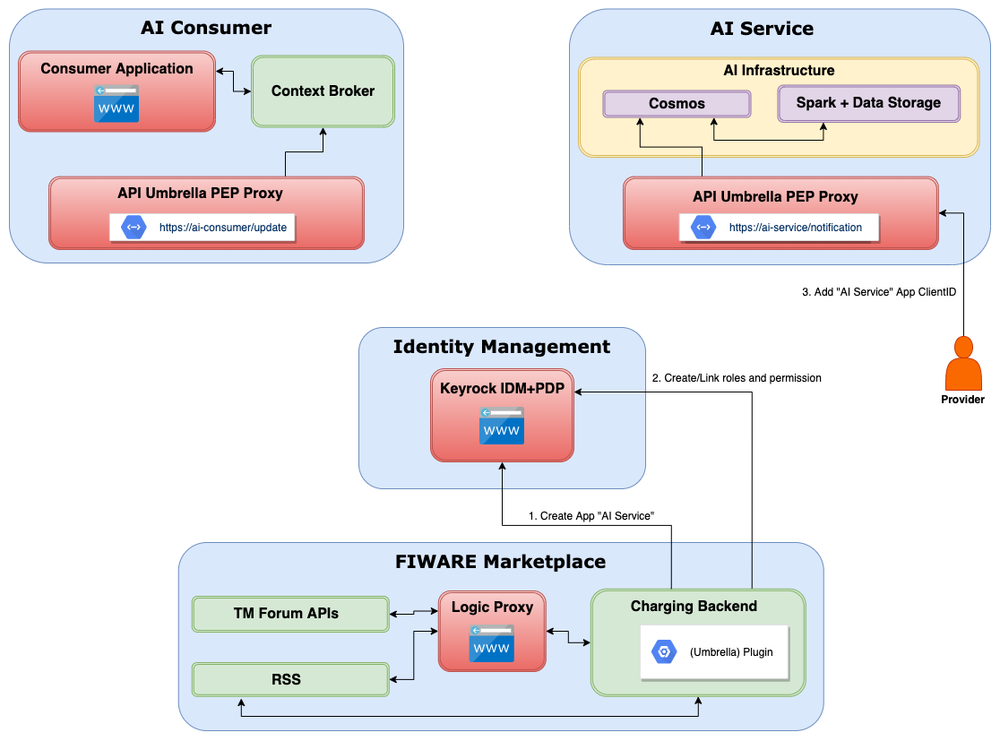
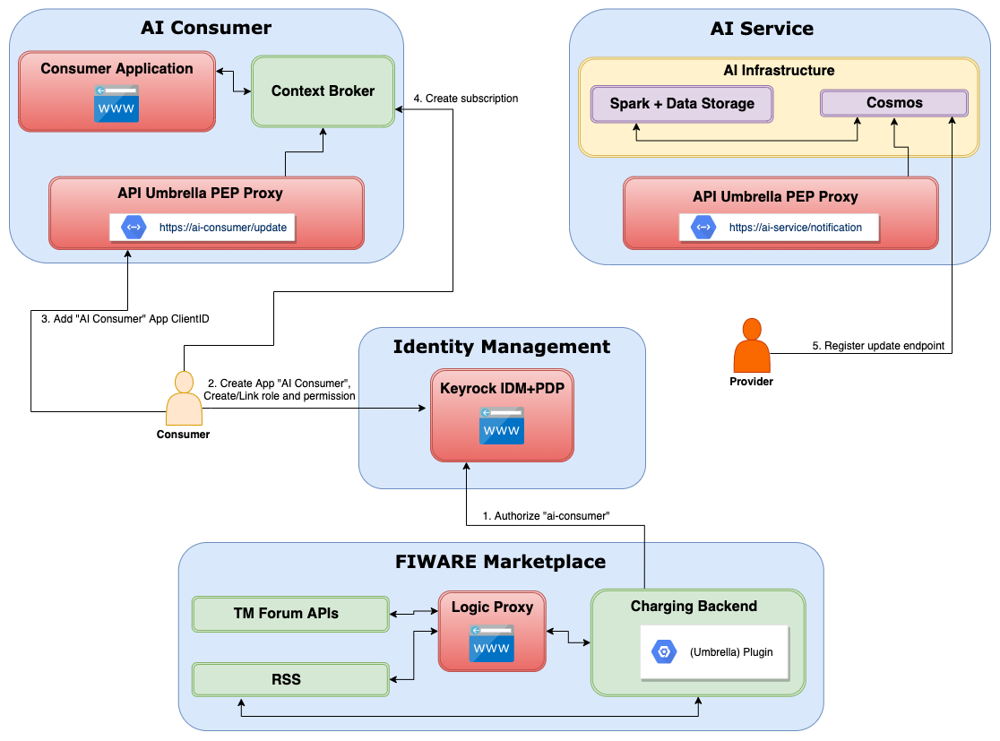
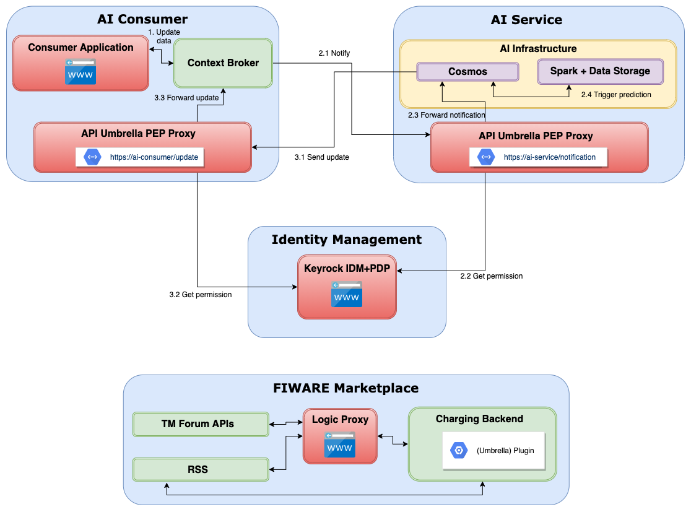

=====================================
Architecture Blueprints
=====================================

.. note::
   This document needs content

What is it about blueprints, asset types and marketplace plugins?

* Introduction to the concept

----------------------------
Blueprints
----------------------------

Architecture blueprints in the AI Marketplace

* Description of "Base Spark on Digital Twins" blueprint, assign PoC architecture components to blueprint

* (Optional) Describe additional blueprint for data provider service

* (Optional) Describe additional blueprint for file data provider service

Base Spark on Digital Twins
*****************************

* Description of the "Base Spark on Digital Twins" blueprint
* On Example of predicting weights of animals

Overview of target architecture between AI consumer and AI Service:

The following describes a simplified target architecture consisting of AI Service, AI Consumer,
FIWARE Marketplace and a central Keyrock IDM instance.

Three different processes must be handled by the plugin for this blueprint.

**Product offer creation:**

User "ai-provider" (registered in Keyrock) creates Product for its "AI Service"

1. In Keyrock (with user ai-provider): 

   * Create App "AI Service" with URL https://ai-service and Password Grant OAuth2 Flow

2. In Keyrock App "AI Service" (with user "ai-provider"): 

   * Create role "ai-service-consumer-notification" 
   * Create permission "AI Service Notification Access" for accessing AI Service notification endpoint (e.g., Action=POST, Resource=notification)
   * Link role and permission

	   

**Acquiring access:**

User "ai-consumer (registered in Keyrock)" acquires access to "AI Service" via Marketplace "buy" process

1. In Keyrock (with user "ai-provider" ???):

   * Authorize user "ai-consumer" for App "AI Service" with role "ai-service-consumer-notification"

2. In Keyrock (with user "ai-consumer" ???):

   * Create App "AI Consumer" with URL https://ai-consumer and Password Grant OAuth2 Flow
   * In App "AI Consumer": Create role "ai-consumer-update"
   * In App "AI Consumer": Create permission "AI Consumer Update Access" for accessing AI Consumer Context Broker Update endpoint (e.g., Action=PATCH, Resource=update)
   * In App "AI Consumer": Link role and permission

3. In Consumer Context Broker:

   * Create subscription to endpoint https://ai-service/notification for changes on attribute "weight" (how to generalize this?!)

4. In "AI Service":

   * Register "AI Consumer" update endpoint https://ai-consumer/update in AI Service Cosmos Connector (OrionSink?!)

**Consuming AI Service:**

1. IoT Agent updates data (here: weight) in Context Broker (PoC: will be simulated)

   * Skip IDM here, as we are within Consumer infrastructure

2. Context Broker notifies AI Service endpoint about value change (here: weight)

   1. Notification send to AI Service PEP Proxy with Consumer token obtained from Keyrock (Umbrella notification endpoint POST https://ai-service/notification)
   2. AI Service Umbrella asks Keyrock about permission to access notification endpoint
   3. If ok, AI Service Umbrella PEP Proxy forwards notification to Cosmos Receiver
   4. Prediction process is triggered within Spark environment

3. Prediction results (weight in 10 days, weight end of season) are updated within Context Broker

   1. Result/Updated data send from Cosmos OrionSink to Consumer PEP Proxy "Update" endpoint https://ai-consumer/update with AI Service token obtained from Keyrock
      (how to register endppint)
   2. Consumer Umbrella asks Keyrock about Permission to access "Update" endpoint
   3. If ok, Consumer Umbrella PEP Proxy forwards "Update" request to Context Broker

**Open Questions:**

* How to generalize "attribute change" for Context Broker subscription?
* How to register Consumer "Update" endpoint within Cosmos (OrionSink)? No API. On "Acquiring access" step, trigger build on Spark environment with target host replaced?
* Check how to grant the blueprint plugin access to Keyrock

  

---------------------------
Plugin implementation
---------------------------

Information about the plugins to be implemented for the blueprints

