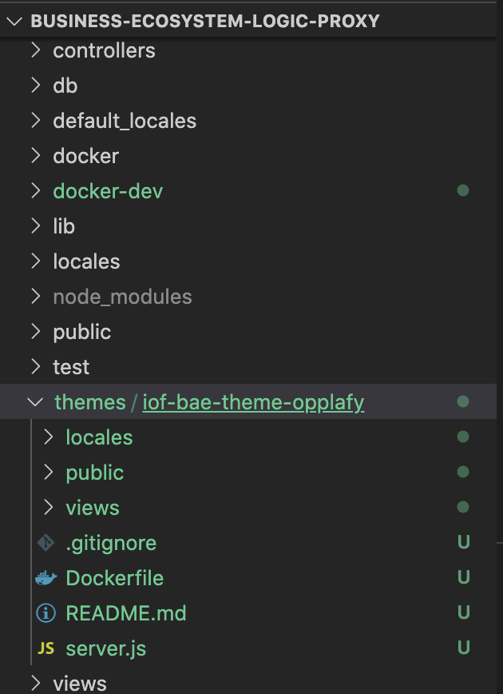
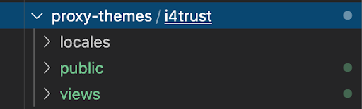
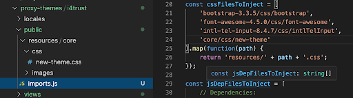
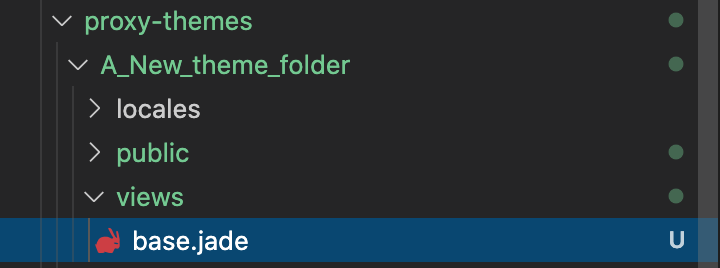
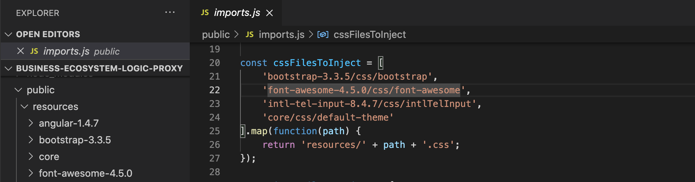
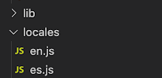
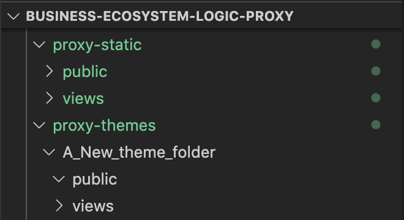

===================
Configuration Guide
===================

This guide covers the different configuration options that are available in order to setup a working Business API
Ecosystem instance. The different Business API Ecosystem components can be configured using two different mecahnisms,
settings files and environment variables.

At this step, the different components of the Business API Ecosystem are installed. In the case of the TMForum APIs and
the RSS, this installation process has already required to configure their database connection before their deployment,
so they are already configured. Nevertheless, this section contains an explanation of the function of the different
settings of the RSS properties files.

------------------------
Configuring the TMF APIs
------------------------

When the TMF APIs are deployed from sources, the connection to the MySQL database is configured during the installation process
setting up the jdbc connection as described in the *Installation and Administration* guide.

On the other hand, the Docker image biz-ecosystem-apis, which is used to the deploy TMF APIs using Docker, uses two environment
variables for configuring such connection. ::

    MYSQL_ROOT_PASSWORD=my-secret-pw
    MYSQL_HOST=mysql

Finally, the TMF APIs can optinally use a configuration file called *settings.properties* which is located by default at */etc/default/apis*.
This file include a setting *server* which allows to provide the URL used to access to the Business API Ecosystem and, in particular, by the APIs
in order to generate *hrefs* with the proper reference. ::

    server=https://store.lab.fiware.org/

This setting can also be configured using the environment variable *BAE_SERVICE_HOST* ::

    export BAE_SERVICE_HOST=https://store.lab.fiware.org/

-------------------
Configuring the RSS
-------------------

The RSS has its settings included in two files located at */etc/default/rss*. The file *database.properties*  contains
by default the following fields: ::

    database.url=jdbc:mysql://localhost:3306/RSS
    database.username=root
    database.password=root
    database.driverClassName=com.mysql.jdbc.Driver

This file contains the configuration required in order to connect to the database.

* database.url: URL used to connect to the database, this URL includes the host and port of the database as well as the concrete database to be used
* database.username: User to be used to connect to the database
* database.password: Password of the database user
* database.driverClassName: Driver class of the database. By default MySQL

In addition, database settings can be configured using the environment. In particular, using the following variables: ::

    export BAE_RSS_DATABASE_URL=jdbc:mysql://mysql:3306/RSS
    export BAE_RSS_DATABASE_USERNAME=root
    export BAE_RSS_DATABASE_PASSWORD=my-secret-pw
    export BAE_RSS_DATABASE_DRIVERCLASSNAME=com.mysql.jdbc.Driver

The file *oauth.properties* contains by default the following fields (It is recommended not to modify them) ::

    config.grantedRole=admin
    config.sellerRole=Seller
    config.aggregatorRole=aggregator

This file contains the name of the roles (registered in the idm) that are going to be used by the RSS.

* config.grantedRole: Role in the IDM of the users with admin privileges
* config.sellerRole: Role in the IDM of the users with seller privileges
* config.aggregatorRole: Role of the users who are admins of an store instance. In the context of the Business API Ecosystem there is only a single store instance, so you can safely ignore this flag

Those settings can also be configured using the environment as ::

    export BAE_RSS_OAUTH_CONFIG_GRANTEDROLE=admin
    export BAE_RSS_OAUTH_CONFIG_SELLERROLE=Seller
    export BAE_RSS_OAUTH_CONFIG_AGGREGATORROLE=Aggregator

--------------------------------
Configuring the Charging Backend
--------------------------------

The Charging Backend creates some objects and connections in the different APIs while working, so the first step is
configuring the different URLs of the Business API Ecosystem components by modifying the file *services_settings.py*,
which by default contains the following content: ::

    SITE = 'http://localhost:8004/'
    LOCAL_SITE = 'http://localhost:8006/'

    CATALOG = 'http://localhost:8080/DSProductCatalog'
    INVENTORY = 'http://localhost:8080/DSProductInventory'
    ORDERING = 'http://localhost:8080/DSProductOrdering'
    BILLING = 'http://localhost:8080/DSBillingManagement'
    RSS = 'http://localhost:8080/DSRevenueSharing'
    USAGE = 'http://localhost:8080/DSUsageManagement'
    AUTHORIZE_SERVICE = 'http://localhost:8004/authorizeService/apiKeys'

This settings points to the different APIs accessed by the charging backend. In particular:

* SITE: External URL of the complete Business API Ecosystem using for Href creation
* LOCAL_SITE: URL where the Charging Backend is going to run
* CATALOG: URL of the catalog API including its path
* INVENTORY: URL of the inventory API including its path
* ORDERING: URL of the ordering API including its path
* BILLING: URL of the billing API including its path
* RSS: URL of the RSS including its path
* USAGE: URL of the Usage API including its path
* AUTHORIZE_SERVICE: Complete URL of the usage authorization service. This service is provided by the logic proxy, and is used to generate API Keys to be used by accounting systems when providing usage information.

Once the services have been configured, the next step is configuring the database. In this case, the charging backend uses
MongoDB, and its connection can be configured modifying the *DATABASES* setting of the *settings.py* file. ::

    DATABASES = {
        'default': {
            'ENGINE': 'django_mongodb_engine',
            'NAME': 'wstore_db',
            'USER': '',
            'PASSWORD': '',
            'HOST': '',
            'PORT': '',
            'TEST_NAME': 'test_database',
        }
    }

This setting contains the following fields:

* ENGINE: Database engine, must be fixed to django_mongodb_engine
* NAME: Name of the database to be used
* USER: User of the database. If empty the software creates a non authenticated connection
* PASSWORD: Database user password. If empty the software creates a non authenticated connection
* HOST: Host of the database. If empty it uses the default *localhost* host
* PORT: Port of the database. If empty it uses the default *27017* port
* TEST_NAME: Name of the database to be used when running the tests

Once the database connection has been configured, the next step is configuring the name of the IdM roles to be used by
updating *settings.py* ::

    ADMIN_ROLE = 'provider'
    PROVIDER_ROLE = 'seller'
    CUSTOMER_ROLE = 'customer'

This settings contain the following values:

* ADMIN_ROLE: IDM role of the system admin
* PROVIDER_ROLE: IDM role of the users with seller privileges
* CUSTOMER_ROLE: IDM role of the users with customer privileges

The charging backend is the component in charge of maintaining the supported currencies and the timeframe of the different
periods using in recurring pricing models. To configure both, the following settings are used: ::

    CURRENCY_CODES = [
        ('EUR', 'Euro'),
        ('AUD', 'Australia Dollar'),
        ...
    ]
    CHARGE_PERIODS = {
        'daily': 1,  # One day
        'weekly': 7,  # One week
        'monthly': 30,  # One month
        ...
    }

* CURRENCY_CODES: Includes the list of currencies supported by the system as a tuple of currency code and currency name.
* CHARGE_PERIODS: Includes the list of supported periods for recurring models, specifing the time (in days) between periodic charges

The Charging Backend component is able to send email notifications to the users when they are charged or receive a payment.
In this way, it is possible to provide email configuration in the *settings.py* file by modifying the following fields: ::

    WSTOREMAILUSER = 'email_user'
    WSTOREMAIL = 'wstore_email'
    WSTOREMAILPASS = 'wstore_email_passwd'
    SMTPSERVER = 'wstore_smtp_server'
    SMTPPORT = 587

This settings contain the following values:
* WSTOREMAILUSER: Username used for authenticating in the email server
* WSTOREMAIL: Email to be used as the sender of the notifications
* WSTOREMAILPASS: Password of the user for authenticating in the email server
* SMTPSERVER: Email server host
* SMTPPORT: Email server port

.. note::
    The email configuration in optional. However, the field WSTOREMAIL must be provided since it is used internally for RSS configuration

Additionally, the Charging Backend is the component that charges customers and pays providers. For this purpose it uses
PayPal. For configuring paypal, the first step is setting *PAYMENT_METHOD* to *paypal* in the *settings.py* file ::

    PAYMENT_METHOD = 'paypal'

Then, it is required to provide PayPal application credentials by updating the file *src/wstore/charging_engine/payment_client/paypal_client.py* ::

    PAYPAL_CLIENT_ID = ''
    PAYPAL_CLIENT_SECRET = ''
    MODE = 'sandbox'  # sandbox or live

This settings contain the following values:

* PAYPAL_CLIENT_ID: Id of the application provided by PayPal
* PAYPAL_CLIENT_SECRET: Secret of the application provided by PayPal
* MODE: Mode of the connection. It can be *sandbox* if using the PayPal sandbox for testing the system. Or *live* if using the real PayPal APIs

Moreover, the Charging Backend is the component that activates the purchased services. In this regard, the Charging Backend
has the possibility of signing its acquisition notifications with a certificate, so the external system being offered can
validate that is the Charging Backend the one making the request. To use this functionality it is needed to configure the
certificate and the private Key to be used by providing its path in the following settings of the *settings.py* file ::

    NOTIF_CERT_FILE = None
    NOTIF_CERT_KEY_FILE = None

The Charging Backend uses a Cron task to check the status of recurring and usage subscriptions, and for paying sellers.
The periodicity of this tasks can be configured using the CRONJOBS setting of settings.py using the standard Cron format ::

    CRONJOBS = [
        ('0 5 * * *', 'django.core.management.call_command', ['pending_charges_daemon']),
        ('0 6 * * *', 'django.core.management.call_command', ['resend_cdrs']),
        ('0 4 * * *', 'django.core.management.call_command', ['resend_upgrade']
    ]

Once the Cron task has been configured, it is necessary to include it in the Cron tasks using the command:
::

    $ ./manage.py crontab add

It is also possible to show current jobs or remove jobs using the commands:
::

    $ ./manage.py crontab show

    $ ./manage.py crontab remove

---------------------------
Configuring the Logic Proxy
---------------------------

Configuration of the Logic Proxy is located at *config.js* and can be provided in two different ways: providing the values
in the file or using the defined environment variables. Note that the environment variables override the values in *config.js*.

The first setting to be configured is the port and host where the proxy is going to run, this settings are located in *config.js* ::

    config.port = 80;
    config.host = 'localhost';

In addition, the environment variables *BAE_LP_PORT* and *BAE_LP_HOST* can be used to override those values. ::

    export BAE_LP_PORT=80
    export BAE_LP_HOST=localhost

If you want to run the proxy in HTTPS you can update *config.https* setting ::

    config.https = {
        enabled: false,
        certFile: 'cert/cert.crt',
        keyFile: 'cert/key.key',
        caFile: 'cert/ca.crt',
        port: 443
    };

In this case you have to set *enabled* to true, and provide the paths to the certificate (*certFile*), to the private key (*keyFile*),
and to the CA certificate (*caFile*).

In order to provide the HTTPS configuration using the environment, the following variables has been defined. ::

    export BAE_LP_HTTPS_ENABLED=true
    export BAE_LP_HTTPS_CERT=cert/cert.crt
    export BAE_LP_HTTPS_CA=cert/key.key
    export BAE_LP_HTTPS_KEY=cert/ca.crt
    export BAE_LP_HTTPS_PORT=443

The logic proxy supports the BAE to be deployed behind a proxy (or NGINX, Apache, etc) not sending X-Forwarding headers. In this
regard, the following setting is used in order to provide information about the actual endpoint which is used to access to the
Business API Ecosystem: ::

    config.proxy = {
        enabled: true,
        host: 'store.lab.fiware.org',
        secured: true,
        port: 443
    };

Which can be also configured using the *BAE_SERVICE_HOST* environment variable. ::

    export BAE_SERVICE_HOST=https://store.lab.fiware.org/

Then, it is possible to modify some of the URLs of the system. Concretely, it is possible to provide a prefix for the API,
a prefix for the portal, and modifying the login and logout URLS ::

    config.proxyPrefix = '';
    config.portalPrefix = '';
    config.logInPath = '/login';
    config.logOutPath = '/logOut';

In addition, it is possible to configure the theme to be used by providing its name. Details about the configuration of
Themes are provided in the *Configuring Themes* section::

    config.theme = '';

The theme can be configured using the *BAE_LP_THEME* variable. ::

    export BAE_LP_THEME=fiwaretheme

Additionally, the proxy is the component that acts as the front end of the Business API Ecosystem, both providing a web portal,
and providing the endpoint for accessing to the different APIs. In this regard, the Proxy has to have the OAuth2 configuration
of the FIWARE IDM.

To provide OAUth2 configuration, an application has to be created in an instance of the FIWARE IdM (e.g `https://account.lab.fiware.org`),
providing the following information:

* URL: http|https://<proxy_host>:<proxy_port>
* Callback URL: http|https://<PROXY_HOST>:<PROXY_PORT>/auth/fiware/callback
* Create a role *Seller*, a role *Admin*, and a role *orgAdmin*

Once the application has been created in the IdM, it is possible to provide OAuth2 configuration by modifying the following settings ::

    config.oauth2 = {
        'server': 'https://account.lab.fiware.org',
        'clientID': '<client_id>',
        'clientSecret': '<client_secret>',
        'callbackURL': 'http://<proxy_host>:<proxy_port>/auth/fiware/callback',
        'isLegacy': false,
        'roles': {
            'admin': 'admin',
            'customer': 'customer',
            'seller': 'seller',
            'orgAdmin': 'orgAdmin'
        }
    };

In this settings, it is needed to include the IDM instance being used (*server*), the client id given by the IdM (*clientID*),
the client secret given by the IdM (*clientSecret*), and the callback URL configured in the IdM (*callbackURL*).

In addition, the different roles allow to specify what users are admins of the system (*Admin*), what users can create products
and offerings (*Seller*), and what users are admins of a particular organization, enabling to manage its information (*orgAdmin*).
Note that while *admin* and *seller* roles are granted directly to the users in the Business API Ecosystem application, the *orgAdmin*
role has to be granted to users within IdM organizations.

.. note::
    Admin, Seller, and orgAdmin roles are configured in the Proxy settings, so any name can be chosen for them in the IDM

The *isLegacy* flag is used to specify whether the configured IDM is version 6 or lower, by default this setting is false. 

The OAuth2 settings cane be configured using the environment as follows: ::

    export BAE_LP_OAUTH2_SERVER=https://account.lab.fiware.org
    export BAE_LP_OAUTH2_CLIENT_ID=client_id
    export BAE_LP_OAUTH2_CLIENT_SECRET=client_secret
    export BAE_LP_OAUTH2_CALLBACK=http://<proxy_host>:<proxy_port>/auth/fiware/callback
    export BAE_LP_OAUTH2_ADMIN_ROLE=admin
    export BAE_LP_OAUTH2_SELLER_ROLE=seller
    export BAE_LP_OAUTH2_ORG_ADMIN_ROLE=orgAdmin

    export BAE_LP_OAUTH2_IS_LEGACY=false

Moreover, the Proxy uses MongoDB for maintaining some info, such as the current shopping cart of a user. you can configure
the connection to MongoDB by updating the following setting: ::

    config.mongoDb = {
        server: 'localhost',
        port: 27017,
        user: '',
        password: '',
        db: 'belp'
    };

In this setting you can configure the host (*server*), the port (*port*), the database user (*user*), the database user password
(*password*), and the database name (*db*).

In addition, the database connection can be configured with the environment as following: ::

    export BAE_LP_MONGO_USER=user
    export BAE_LP_MONGO_PASS=pass
    export BAE_LP_MONGO_SERVER=localhost
    export BAE_LP_MONGO_PORT=27017
    export BAE_LP_MONGO_DB=belp

As already stated, the Proxy is the component that acts as the endpoint for accessing the different APIs. In this way,
the proxy needs to know the URLs of them in order to redirect the different requests. This endpoints can be configured using the
following settings ::

    config.endpoints = {
        'catalog': {
            'path': 'DSProductCatalog',
            'host': 'localhost'
            'port': '8080',
            'appSsl': false
        },
        'ordering': {
            'path': 'DSProductOrdering',
            'host': 'localhost'
            'port': '8080',
            'appSsl': false
        },

        ...

The setting *config.endpoints* contains the specific configuration of each of the APIs, including its *path*, its *host*,
its *port*, and whether the API is using SSL or not.

.. note::
    The default configuration included in the config file is the one used by the installation script, so if you have used the script for
    installing the Business API Ecosystem you do not need to modify these fields

Each of the different APIs can be configured with environment variables with the following pattern: ::

    export BAE_LP_ENDPOINT_CATALOG_PATH=DSProductCatalog
    export BAE_LP_ENDPOINT_CATALOG_PORT=8080
    export BAE_LP_ENDPOINT_CATALOG_HOST=localhost
    export BAE_LP_ENDPOINT_CATALOG_SECURED=false

The Business API Ecosystem uses an indexes system managed by the Logic Proxy in order to perform queries,
searches, and paging the results. Starting in version 7.6.0 it is possible to use elasticsearch for the
indexing rather than using the local file system. The indexing system is configured with the following settings. ::

    config.indexes = {
        'engine': 'local', // local or elasticsearch
        'elasticHost': 'elastic.docker:9200'
    };

The *engine* setting can be used to chose between *local* indexes and *elasticsearch* indexes.
If the later is chosen the URL of elasticsearch is provided with *elasticHost*. 

Finally, there are two fields that allow to configure the behaviour of the system while running. On the one hand, *config.revenueModel*
allows to configure the default percentage that the Business API Ecosystem is going to retrieve in all the transactions.
On the other hand, *config.usageChartURL* allows to configure the URL of the chart to be used to display product usage to
customers in the web portal. They can be configured with environment variables with *BAE_LP_REVENUE_MODEL* and *BAE_LP_USAGE_CHART*

------------------
Configuring Themes
------------------

The Business API Ecosystem provides a basic mechanism for the creation of themes intended to customize the web portal of the system. Themes include a set of files which can override any of the default portal files located in the *public/resources*
or *views* directories of the logic proxy. To do that, themes map the directory structure and include files with the same name of the default ones to be overridden.

To customize the theme of the Business API Ecosystem, the software to look at is the `Business API Ecosystem Logic Proxy <https://github.com/FIWARE-TMForum/business-ecosystem-logic-proxy>`_. 
There is a defined mechanism for creating themes. The themes are created as a separate package; you can select a name for it and then you provide the different contents and the particular theme to be used. This theme can be configured in the main settings of the business ecosystem, in particular in the config.js file in the theme section. The name of the folder containing the theme has to be specified there. ::

    //Express Configuration 
    config.proxyPrefix = '';
    config.portalPrefix = '';
    config.logInPath = '/login';
    config.logOutPath = '/logOut';
    config.sessionSecret = 'keyboard cat'
    config.theme = '';

Since we are using Docker, the alternative is to precise the theme folder in the environment variable in the docker-compose.yml file as in the last line of the following code: ::

    # ------ OAUTH2 Config ------
            - BAE_LP_OAUTH2_SERVER=http://idm.docker:8000  # URL of the FIWARE IDM used for user authentication
            - BAE_LP_OAUTH2_CLIENT_ID=id  # OAuth2 Client ID of the BAE applicaiton
            - BAE_LP_OAUTH2_CLIENT_SECRET=secret  # OAuth Client Secret of the BAE application
            - BAE_LP_OAUTH2_CALLBACK=http://proxy.docker:8004/auth/fiware/callback  # Callback URL for receiving the access tokens
            - BAE_LP_OAUTH2_ADMIN_ROLE=admin  # Role defined in the IDM client app for admins of the BAE 
            - BAE_LP_OAUTH2_SELLER_ROLE=seller  # Role defined in the IDM client app for sellers of the BAE 
            - BAE_LP_OAUTH2_CUSTOMER_ROLE=customer  # Role defined in the IDM client app for customers of the BAE 
            - BAE_LP_OAUTH2_ORG_ADMIN_ROLE=orgAdmin  # Role defined in the IDM client app for organization admins of the BAE 
            - BAE_LP_OAUTH2_IS_LEGACY=false  # Whether the used FIWARE IDM is version 6 or lower

            # - BAE_LP_THEME=theme  # If provided custom theme to be used by the web site, it must be included in themes volume

Firstly, the BAE instance needs to be run in developer mode so that we can make changes; a docker dev folder enables that. In this docker dev folder we can find the docker-compose.yml file that has the proxy service which is the container of the marketplace front end. 
The idea of the theme is that we have to provide a folder that maps the same structure of the Business API Ecosystem structure as seen in the image: 

Running the logic proxy docker-dev instance
-------------------------------------------

Step 1: running the container with docker
+++++++++++++++++++++++++++++++++++++++++

We will keep the same code structure provided under this link so first we need to clone it and the only thing we will change is the docker-compose.yml file under the docker-dev folder and you can copy the code in it. 

The following is a docker compose file that deploys the whole system using the docker-dev image that enables development and particularly in our case make theme configuration. 

PS: This does not require rebuilding the image but it loads all the source files locally as volume into the container. ::

    version: '3'
    services:
      elasticsearch:
        image: docker.elastic.co/elasticsearch/elasticsearch:7.5.0
        environment:
          - 'node.name=BAE'
          - 'discovery.type=single-node'
          - 'ES_JAVA_OPTS=-Xms256m -Xmx256m'
        ports:
          - "127.0.0.1:9200:9200"
        networks:
          main:
            aliases:
              - elastic.docker

      mongo:
        image: mongo:3.2
        ports:
          - 27017:27017
        networks:
          main:
        volumes:
          - ./proxy-data:/data/db

      mysql:
        image: mysql:5.7
        #restart: always
        volumes:
          - ./mysql-data:/var/lib/mysql
        networks:
          main:
        environment:
          - MYSQL_ROOT_PASSWORD=my-secret-password
          - MYSQL_DATABASE=RSS

      charging:
        image: fiware/biz-ecosystem-charging-backend:v7.8.0
        links:
          - mongo
        depends_on:
          - mongo
        networks:
          main:
            aliases:
              - charging.docker
        ports:
          - 8006:8006
        volumes:
          # - ./charging-settings:/business-ecosystem-charging-backend/src/user_settings  # Used if the settings files are provided through the volume
          - ./charging-bills:/business-ecosystem-charging-backend/src/media/bills
          - ./charging-assets:/business-ecosystem-charging-backend/src/media/assets
          - ./charging-plugins:/business-ecosystem-charging-backend/src/plugins
          - ./charging-inst-plugins:/business-ecosystem-charging-backend/src/wstore/asset_manager/resource_plugins/plugins
        environment:
          - BAE_CB_PAYMENT_METHOD=None # paypal or None (testing mode payment disconected)
          # - BAE_CB_PAYPAL_CLIENT_ID=client_id
          # - BAE_CB_PAYPAL_CLIENT_SECRET=client_secret

          # ----- Database configuration ------
          - BAE_CB_MONGO_SERVER=mongo
          - BAE_CB_MONGO_PORT=27017
          - BAE_CB_MONGO_DB=charging_db
          # - BAE_CB_MONGO_USER=user
          # - BAE_CB_MONGO_PASS=passwd

          # ----- Roles Configuration -----
          - BAE_LP_OAUTH2_ADMIN_ROLE=admin
          - BAE_LP_OAUTH2_SELLER_ROLE=seller
          - BAE_LP_OAUTH2_CUSTOMER_ROLE=customer

          # ----- Email configuration ------
          - BAE_CB_EMAIL=charging@email.com
          # - BAE_CB_EMAIL_USER=user
          # - BAE_CB_EMAIL_PASS=pass
          # - BAE_CB_EMAIL_SMTP_SERVER=smtp.server.com
          # - BAE_CB_EMAIL_SMTP_PORT=587

          - BAE_CB_VERIFY_REQUESTS=True # Whether or not the BAE validates SSL certificates on requests to external components

          # ----- Site configuration -----
          - BAE_SERVICE_HOST=http://proxy.docker:8004/ # External URL used to access the BAE
          - BAE_CB_LOCAL_SITE=http://charging.docker:8006/ # Local URL of the charging backend

          # ----- APIs Conection config -----
          - BAE_CB_CATALOG=http://apis.docker:8080/DSProductCatalog
          - BAE_CB_INVENTORY=http://apis.docker:8080/DSProductInventory
          - BAE_CB_ORDERING=http://apis.docker:8080/DSProductOrdering
          - BAE_CB_BILLING=http://apis.docker:8080/DSBillingManagement
          - BAE_CB_RSS=http://rss.docker:8080/DSRevenueSharing
          - BAE_CB_USAGE=http://apis.docker:8080/DSUsageManagement
          - BAE_CB_AUTHORIZE_SERVICE=http://proxy.docker:8004/authorizeService/apiKeys

      proxy:
        image: proxy-dev
        links:
          - mongo
        depends_on:
          - mongo
        ports:
          - 8004:8004
        networks:
          main:
            aliases:
              - proxy.docker
        volumes:
          - ../:/business-ecosystem-logic-proxy

      apis:
        image: fiware/biz-ecosystem-apis:v7.6.0
        #restart: always
        ports:
          - 4848:4848
          - 8080:8080
        links:
          - mysql
        depends_on:
          - mysql
        networks:
          main:
            aliases:
              - apis.docker
        # volumes:
        #    - ./apis-conf:/etc/default/tmf/  # Used if not configured by environment
        environment:
          - BAE_SERVICE_HOST=http://proxy.docker:8004/
          - MYSQL_ROOT_PASSWORD=my-secret-password
          - MYSQL_HOST=mysql
          - BAE_LP_THEME=my-new-theme-name  #theme name has to be put here  
          - COLLECT=True          # to execute the collect_static.js 

      rss:
        image: fiware/biz-ecosystem-rss:v7.8.0
        #restart: always
        ports:
          - 9999:8080
          - 4444:4848
          - 1111:8181
        links:
          - mysql
        depends_on:
          - mysql
        networks:
          main:
            aliases:
              - rss.docker
        # volumes:
        #    - ./rss-conf:/etc/default/rss  # Used if not configured by environment
        environment:
          - BAE_RSS_DATABASE_URL=jdbc:mysql://mysql:3306/RSS
          - BAE_RSS_DATABASE_USERNAME=root
          - BAE_RSS_DATABASE_PASSWORD=my-secret-password
          - BAE_RSS_DATABASE_DRIVERCLASSNAME=com.mysql.jdbc.Driver
          - BAE_RSS_OAUTH_CONFIG_GRANTEDROLE=admin
          - BAE_RSS_OAUTH_CONFIG_SELLERROLE=seller
          - BAE_RSS_OAUTH_CONFIG_AGGREGATORROLE=Aggregator

    networks:
      main:
        external: true

Step 2: pre-configuration of the proxy-dev image 
++++++++++++++++++++++++++++++++++++++++++++++++
Our target here is to run the UI with a new theme that we provide. To enable the compilation of this new theme make sure to precise the name of the new theme to be used in the environment variable in our docker-compose file by adding this line: ::

    - BAE_LP_THEME= <theme name>

Here is an example: ::

    environment:
          - BAE_SERVICE_HOST=http://proxy.docker:8004/
          - MYSQL_ROOT_PASSWORD=my-secret-password
          - MYSQL_HOST=mysql
          - BAE_LP_THEME= my-new-theme-name  #theme name has to be put here

The other thing we should pay attention to is the creation of the static files for the theme, we can do this by adding the following in the environment variables in the proxy-dev image: ::

    - COLLECT=True

And finally we should have something like this: ::

    environment:
          - BAE_SERVICE_HOST=http://proxy.docker:8004/
          - MYSQL_ROOT_PASSWORD=my-secret-password
          - MYSQL_HOST=mysql
          - BAE_LP_THEME= my-new-theme-name  #theme name has to be put here  
          - COLLECT=True          # to execute the collect_static.js 

Step 3: building the docker-dev image 
+++++++++++++++++++++++++++++++++++++

The first step for using this container is building it, you can do that with the following command: ::

    docker build -t proxy-dev .

Then, you can run the container using the following command: ::

    docker-compose up

Step 4: starting the proxy using the docker-dev image
+++++++++++++++++++++++++++++++++++++++++++++++++++++

We can open a shell in the container using the following command: ::

    docker exec -ti dockerdev_proxy_1 /bin/bash

Then once we are in the shell we need to execute the following command: ::

    $ node server.js 

Finally, we will be able to open the Marketplace in the browser `here <http://localhost:8004/>`_.  

Configuring the Theme
---------------------

Link to the Github repo of a theme example can be found `here <https://github.com/FIWARE-AI-Marketplace/bae-i4trust-theme>`_.

The following picture shows the Look and feel of the new theme: 

.. image:: ./images/diagrams/themedoc6.png
   :align: center

Now we will create our theme folder following the same structure that maps the bae-proxy structure:

Creating a new css file
+++++++++++++++++++++++
If we want to make some changes in the theme related to the graphical chart this would require creating a new css file with the wanted style. So by default what is running currently is the default-theme.css and what we have to do is to create a new css file following this structure:

**proxy-themes/<name of new theme folder>/public/resources/core/<new css file>.css**

PS: we can copy the code from the default-theme.css and edit it. 

To apply the new css file we need to override the **imports.js** file shown in the following structure.

There we change the path to the new-theme in **cssFilesToInject**. ::

    const cssFilesToInject = [
        'bootstrap-3.3.5/css/bootstrap',
        'font-awesome-4.5.0/css/font-awesome',
        'intl-tel-input-8.4.7/css/intlTelInput',
        'core/css/new-theme'
    ].map(function(path) {
        return 'resources/' + path + '.css';
    });

Changing the logo
+++++++++++++++++
To change the logo we can do the following: 
The file we have to look at is the **base.jade** so as we did previously since we will change this file we will copy it in the theme folder that we created and as always keeping the same structure of the file that maps the bae-proxy. So we should have a structure like this: 

The path to the desired logo file can be added there ::

     a.navbar-brand.hidden-xs(href="#{ contextPath }")
       img(src="#{ contextPath }/mypath/images/My_New_Logo_RGB.svg")
    .navbar-text {{title}}

.. note::
   The logo image must be uploaded under public>resources>core>images

Changing the browser's title bar
++++++++++++++++++++++++++++++++

To change the browser’s title bar the file we have to look at is still the **base.jade**

There, in line 4 the new title can be entered: ::

    doctype html
    html(ng-app="app")
        head
            title New Title

Changing the font 
+++++++++++++++++
To change the font we can download the font we want and add it under **Public > resources> <new-font-file>**. 

To apply the new font we need to override the **imports.js** file and change the path to the new-font in the **cssFilesToInject**. ::

    const cssFilesToInject = [
        'bootstrap-3.3.5/css/bootstrap',
        'font-awesome-4.5.0/css/font-awesome',
        'intl-tel-input-8.4.7/css/intlTelInput',
        'core/css/KI_MP_theme'
    ].map(function(path) {
    return 'resources/' + path + '.css';
    });

Changing the translation
++++++++++++++++++++++++
To add new translation languages to the Marketplace what we need to look at is the **locales** folder in which we can add the language.js or language.json  file we need that translates the strings we have in the graphical interface. 

Changing the html / Javascript
++++++++++++++++++++++++++++++
To make changes in the **html** components of the Marketplace what we need to look at is the **views** folder which has the jade files and also if we want to change anything in the **Javascript** what we need to look at is the **public** folder. 
So when changing in the html or the Javascript, we can just recreate a jade file or a js file in the new-theme folder and keep the same files structure that maps the bae-proxy structure. 

If we not only want to replace things but add new files, we need to overwrite the imports.js folder in which we can specify the path to the new files injected.

Steps to compile the new theme
------------------------------
When we execute the **collect_static.js** file it is going to generate a static folder which incorporates the whole compiled Marketplace that merges the created new-theme and the default theme.

We can execute the collect_static.s by adding this line ::

     - COLLECT=True  

to the environment var in the docker-compose.yml file under the docker-dev like follows: ::

    environment:
            # ------ OAUTH2 Config ------
            - BAE_LP_OAUTH2_SERVER=https://marketplace-accounts.fiware.io  # URL of the FIWARE IDM used for user authentication
            - BAE_LP_OAUTH2_CLIENT_ID= <client_ID>    # OAuth2 Client ID of the BAE applicaiton
            - BAE_LP_OAUTH2_CLIENT_SECRET=<client_secret>  # OAuth Client Secret of the BAE application
            - BAE_LP_OAUTH2_CALLBACK=http://localhost:8004/auth/fiware/callback  # Callback URL for receiving the access tokens
            - BAE_LP_OAUTH2_ADMIN_ROLE=admin  # Role defined in the IDM client app for admins of the BAE 
            - BAE_LP_OAUTH2_SELLER_ROLE=seller  # Role defined in the IDM client app for sellers of the BAE 
            - BAE_LP_OAUTH2_CUSTOMER_ROLE=customer  # Role defined in the IDM client app for customers of the BAE 
            - BAE_LP_OAUTH2_ORG_ADMIN_ROLE=orgAdmin  # Role defined in the IDM client app for organization admins of the BAE 
            - BAE_LP_OAUTH2_IS_LEGACY=false  # Whether the used FIWARE IDM is version 6 or lower
            - BAE_LP_THEME=A_New_theme_folder
            - COLLECT=True

To be able to test the changes we make under the docker-dev we have to stop the proxy container by ::

    docker-compose down 

and run it again with ::

    docker-compose up 

The Marketplace will then be accesible in the browser `here <http://localhost:8004/>`_.

-------------------
Enabling Production
-------------------

The default installation of the Business API Ecosystem deploys its different components in *debug* mode. This is useful
for development and testing but it is not adequate for production environments.

Enabling the production mode makes the different components to start caching requests and views and minimizing JavaScript
files.

To enable the production mode, the first step is setting the environment variable *NODE_ENV* to *production* in the machine
containing the Logic Proxy. ::

    $ export NODE_ENV=production

Then, it is needed to collect static files in order to compress JavaScript files. ::

    $ node collect_static.js

Finally, change the setting *DEBUG* of the Charging Backend to False. ::

    DEBUG=False
