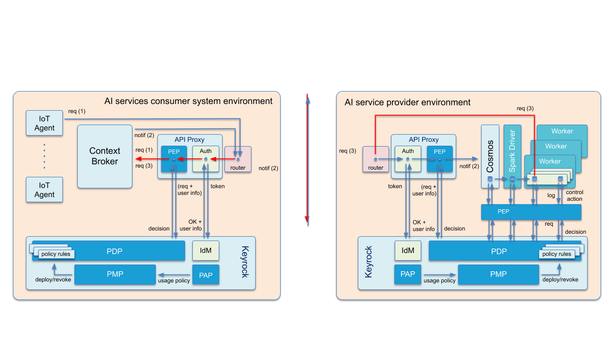

====================
Proof of concept
====================

.. note::
   This document needs content

Introduction to the PoC

* General description of the proof of concept
* Showcase for the activation and usage of an AI service offered via the marketplace
* Brief introduction of the 3 parties involved: marketplace, AI service and consumer

This Proof of Concept aims at showing that a marketplace can be built leveraging on the components of the `Business API Ecosystem <https://github.com/FIWARE-TMForum/Business-API-Ecosystem>`_ and can function as an AI-Marketplace. 
Essentially, there are three parties involved in a marketplace like that: 
* The marketplace provider (and perhaps also platform administrator)
* The asset provider
* The asset consumer

Depending of the type of service, the provider and the consumer can change. In this PoC documentation we will be differentiating between three types of assets:

* Basic data files
* NGSI-LD data resources (mapping to queries on the Context Broker)
* AI-Service

This PoC will be supporting the whole lifecycle of an asset on the marketplace, from its provisioning by the provider on the marketplace to its consumption by the consumer and the whole process that happens in between using the `Business API Ecosystem <https://github.com/FIWARE-TMForum/Business-API-Ecosystem>`_. 
In this section of the documentation, one or more use cases of each asset type is described. Then, a technical overview of the Marketplace as a whole is given. In the section :ref:`Architecture Blueprints`, each asset type is associated with a so-called blueprint and described there.

-----------------
Use cases
-----------------

* Use Case 1: Data Provisioning as Basic File
* Use Case 2: Data Provisioning via NGSI-LD using the Context Broker
* Use Case 3: AI-Service 
	* Story 3.1: Consumer activates AI service via marketplace, AI service is already available with a pre-trained model, marketplace notifies AI service about prediction endpoint, subscription to context broker about prediction results, consumer sends updates on current animal state, consumer gets prediction results
	* Story 3.2 (optional): Provider and Consumer process for a data service
* Description should be provided for the 3 different views of involved parties: marketplace, AI service and consumer.

-------------------
Technical Overview
-------------------

In this section, an overview of the technical infrastructure of the proof of concept is given. It is split into three environments: Marketplace environment, AI/ML service run environment, Consumer application environment.

Marketplace Environment
-----------------------
The Standard FIWARE Marketplace architecture consists of the Business API Ecosystem, the Security API (Keyrock and the Umbrella Service), as well as the provisioning of the activated AI service.

The FIWARE Marketplace, The AI Service as well as the consumer application all connected to the Keyrock Identity Management Service.

AI-Service Environment
----------------------
* AI service: Spark cluster (+ data storage), cosmos connector, PEP

.. note::
   * What is the difference between what should be described here and in the following section AI-Service?
   * Completion of this subsection after AI Service is available

“Current weight” is one of the properties of the digital twin of each animal: its value is gathered through sensors and updated on the Context Broker via NGSI-LD by IoT Agents.
Once the initial Machine Learning phase has finalized, current weight per each animal is notified (from Context Broker to Cosmos)for analysis. Based on results of the real-time analysis using AI algorithms, the value of properties “weight in 10 days” and “weight end of season” may vary from previous calculations so values of these properties are updated on the Context Broker via NGSI-LD (Context Broker to Spark Cluster).
Applications may be subscribed to changes on these properties to create alerts for the farmer.
The AI service and the consumer application run in separate environments, and security components have to be put in place to enforce terms and conditions 

Consumer Application Environment 
--------------------------------
* Consumer: Dashboard application for viewing prediction results, Context Broker for subscribing to prediction results, PEP

Data Service Environment
------------------------

* Add details when providing a data service

------------------------
AI Service
------------------------

Description and details about the AI Service

.. note::
   Info about AI service to be completed once service is built (Rihab)

* Description of the example AI service to be offered via the marketplace

The AI service offered in this PoC marketplace is a machine learning algorithm that can be developed using Spark ML libraries to predict fatting of the animals, thus enabling the implementation of adjustments in their diet. The weight of each animal in a farm is measured every day as well as the location of the animal in coordinates describing its movement. “Current weight” is one of the properties of the digital twin of each animal: its value is gathered through sensors and updated on the Context Broker via NGSI-LD by IoT Agents.
Once the initial Machine Learning phase has finalized, current weight per each animal is notified for analysis. Based on results of the real-time analysis using AI algorithms, the value of properties “weight in 10 days” and “weight end of season” may vary from previous calculations so values of these properties are updated on the Context Broker via NGSI-LD.
Applications may be subscribed to changes on these properties to create alerts for the farmer. 

Dataset description: We will get real life data from the company Senso Wave, the dataset has the following attributes GPS data, animal weight, temperature..(1 million sample in average). Contact person for data:  Ignacio Gomez Maqueda  imaqueda@sensowave.com 

* Computing resources: Depends on the amount of data and the weight of the AI algorithm used. 
* Contact person from UPM: sonsoles.lopez.pernas@alumnos.upm.es  
* Details about implementation
* PEP configuration

Building a plug&play AI service
-------------------------------

Company “IntelligentFarming GmbH” may decide to offer a predictive animal fatting service which operators of farm management systems can acquire rights to use as an add-on to the farm management system they operate.
The “Predictive Fatting” AI service and the consuming farm management system run in separate environments, and security components have to be put in place to enforce tems and conditions.

“Current weight” is one of the properties of the digital twin of each animal: its value is gathered through sensors and updated on the Context Broker via NGSI-LD by IoT Agents (1).
Because access to the Context Broker is secured, updates from IoT Agents go through a proxy (after routing) where the request is first authorized via OAuth and then access control policies are enforced following a XACML schema.

Updates of the “current weight” property for each animal are notified for analysis (2)
Notifications are routed to the cloud operated by “IntelligentFarming GmbH” where the ”Predictive Fatting” AI service is hosted.
Because access to the AI Service is secured, notifications go through a proxy (after routing inside the cloud operated by ”Intelligent Farming GmbH”) where the notification is authorized via OAuth and access control policies are enforced following a XACML schema.

Notifications are processed in real-time through AI/ML algorithms on Spark
Data usage control policies are enforced since Spark logs are processed.  If the algorithms to be applied on notified data do not comply with defined data use control policies, the processing is interrupted.

Based on results of the real-time analysis using AI algorithms, the value of properties “weight in 10 days” and “weight end of season” may vary from previous calculations so values of these properties are updated via NGSI-LD on the Context Broker whose end point should have been registered by the farm management system operator which activated usage of the service (3)
These updated requests are routed to the Context Broker of the farm management system and, since access to it is secured, they have to go through the proxy which grants authorization and enforces access control policies

Exchange between organizations can be implemented via IDS Connectors at both ends, ensuring trusted exchange at organization level

