File service hosted at marketplace
===================================

This section describes the steps that enable putting up an offering of a dataset on the marketplace and those necessary to consume it. The architecture of this part of the market are very close to those described under the NGSI-LD based data service section except that here, the data files are hosted on the marketplace itself.

As a prerequisite of using the steps described in the following two subsections, one needs to install the `basic file plugin <https://github.com/FIWARE-TMForum/biz-basic-plugins/tree/master/basic-file>`_ , but this is also already referenced in the plugins section.

The marketplace you can see in the following screenshots has the theme of the project i4Trust which you can find `here <https://github.com/FIWARE-AI-Marketplace/bae-i4trust-theme>`_. You can find more on theme configuration under :ref:`Configuring Themes`.

Seller
-----------------

To make a product offering on the marketplace, please follow the following steps.

Create Product Specifications
*****************************

First, go to the tab called my stock on the left. There you will be able to see your Catalogues, Product specifications as well as offerings according to which of the three you choose. Click on the tab “Product Specification” on the left and on “+ New” to add a product specification.

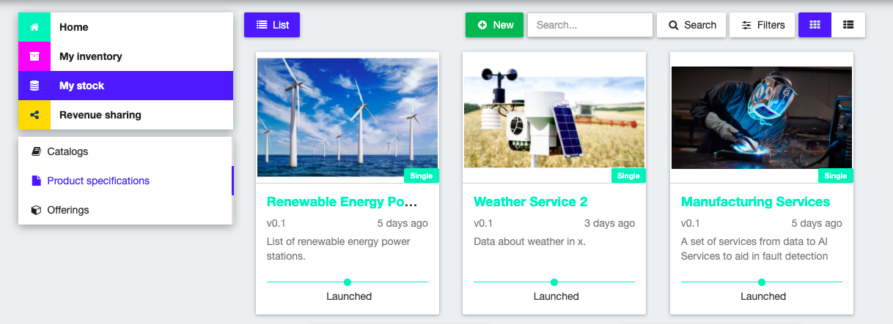

There you will be guided through a seven step process that is more or less self-explanatory.

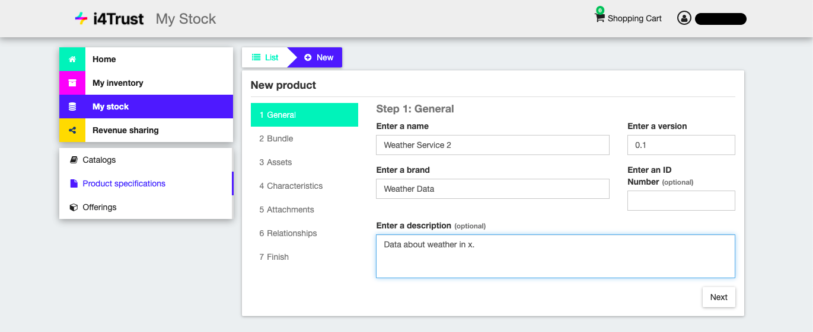

Unless what you are creating is a bundle of product specifications, keep the bundle button switched off.

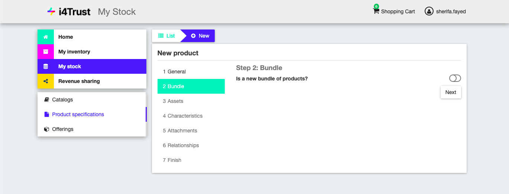

In step 5 of the process, you can add a picture representing your offering either through a URL or through uploading a picture from your computer.

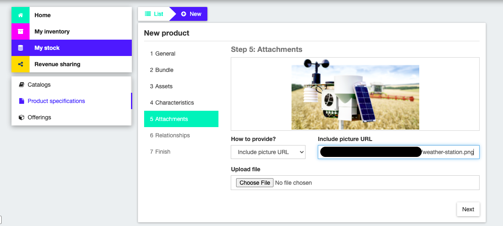

In step 6 you can choose the catalog that your product offering belongs to.

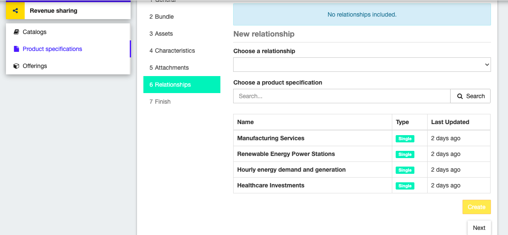

In step 7 you have the chance to review your product specification and then you finish by clicking “Create”.

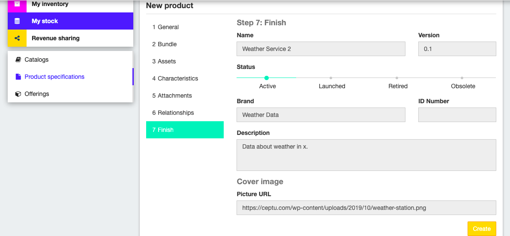

Afterwards, change the status to “Launched” by clicking on that part of the timeline then on Update. Creating a product specification alone does not make it appear in the marketplace and thereby in the Home section. To offer your product in the marketplace, an offering relying on it needs to be created.

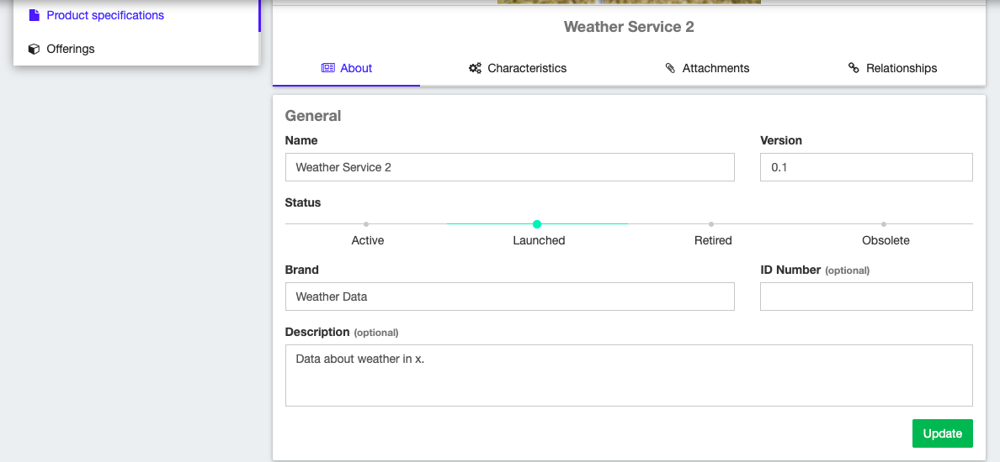

Create Offering
***************

To create an actual offering, go the Offerings tab under my stock on the left. And here, click on “+ New”.

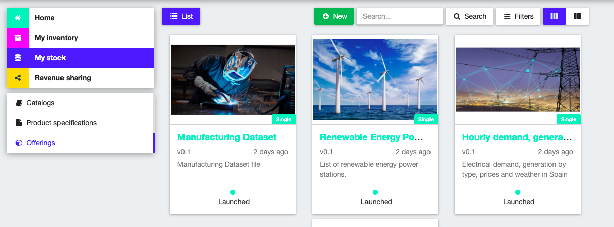

Just like the process of creating a product specifications, you will be taken here through a similar process. 

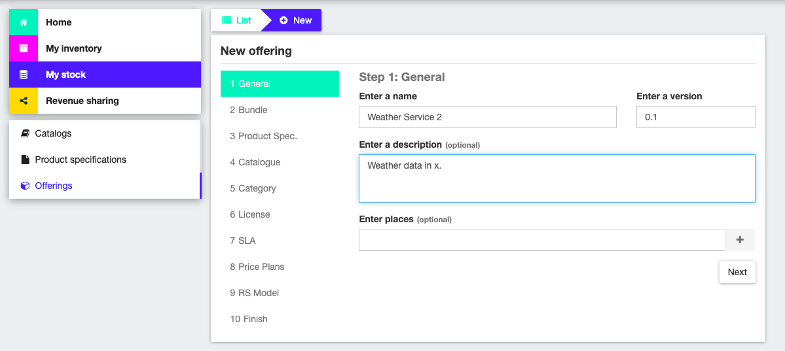

In step 3 you can choose the product specification that your offering is based on.

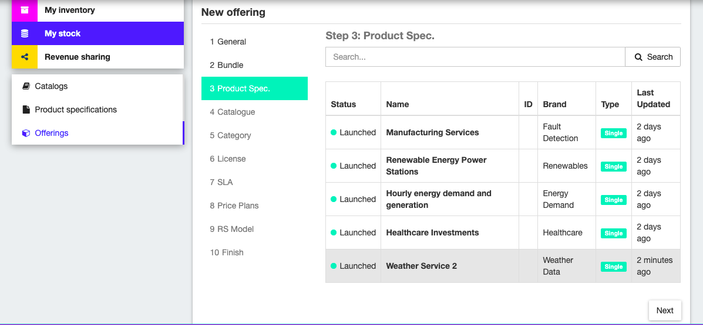

In step 4 you can choose the catalog you want your offering to be found in.

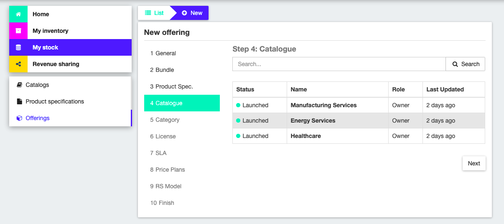

In step 8 you can define a price plan and in step 9 a revenue sharing model. You can either create a new one or choose the existing one which gives the seller/ provider 70% of the profit and the platform 30%.

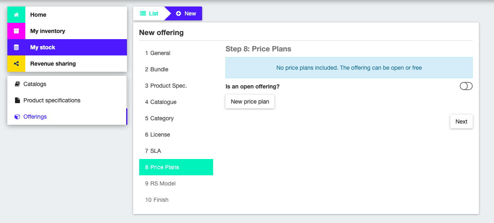

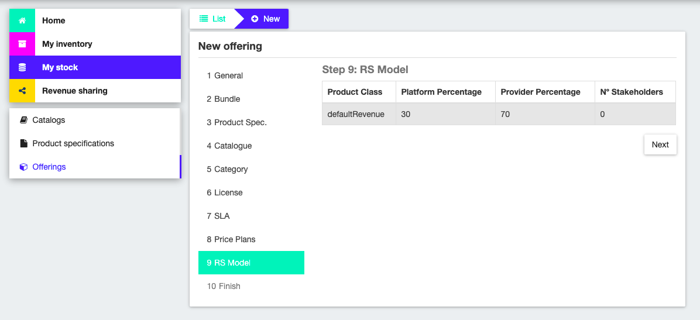

To finish, click on Create after reviewing your offering.

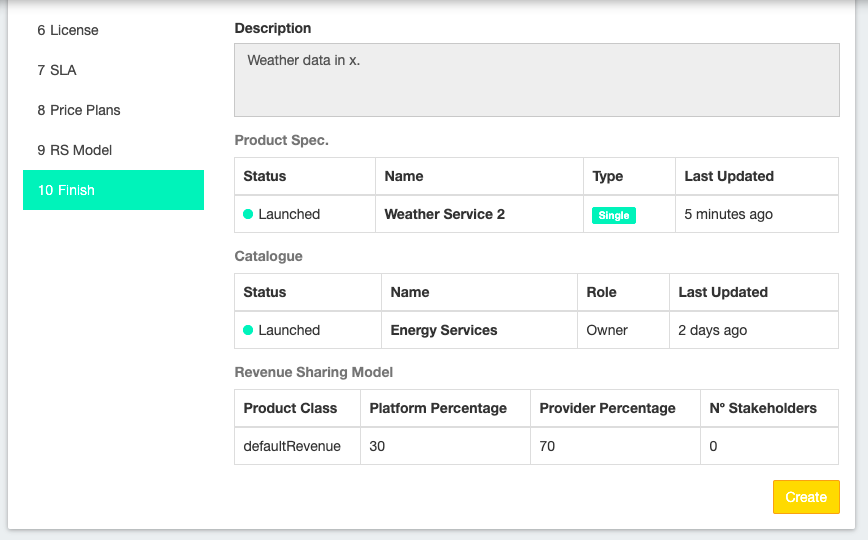

Then bring the status to “Launched” and click on Update. After that, you will see your offering has appeared on the home page.

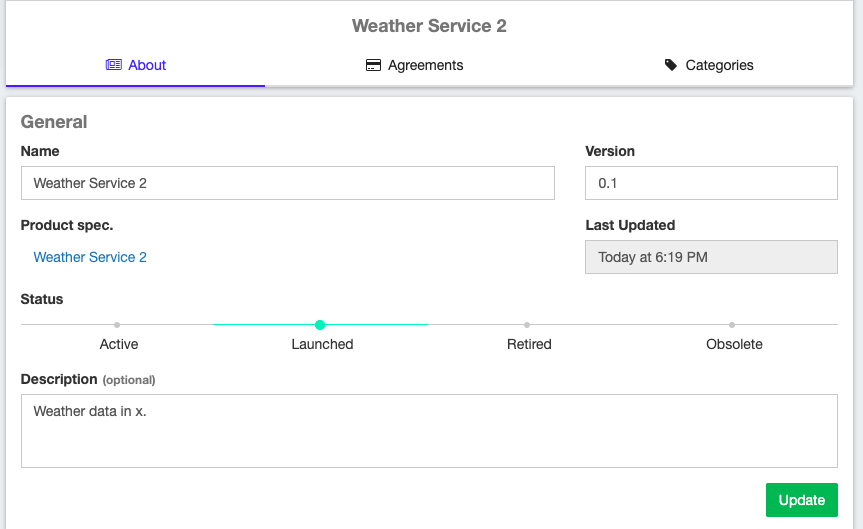

Customer
-----------------

To purchase an offering, click add to cart on the desired offering.

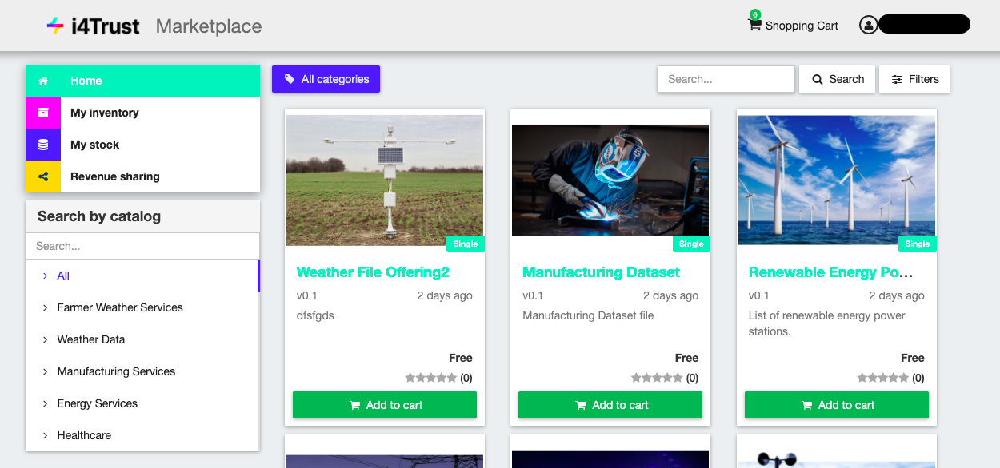

After reviewing, confirm by clicking on “Add to cart” again.

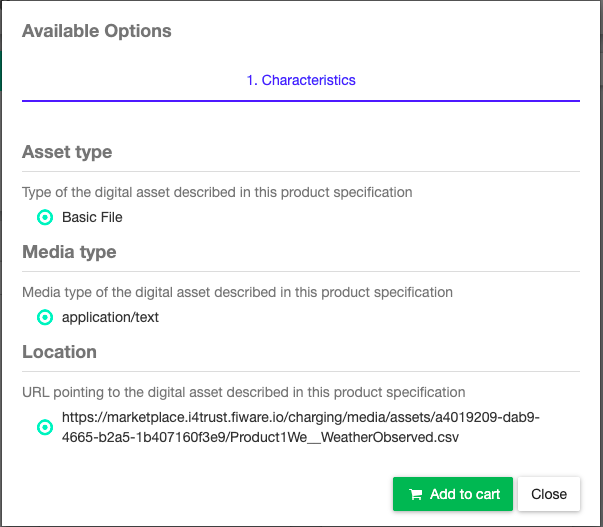

You will be able to see that it has been added and that your Shopping Cart has one item added to it. Proceed to checkout by clicking “Shopping Cart” and then “Checkout”.

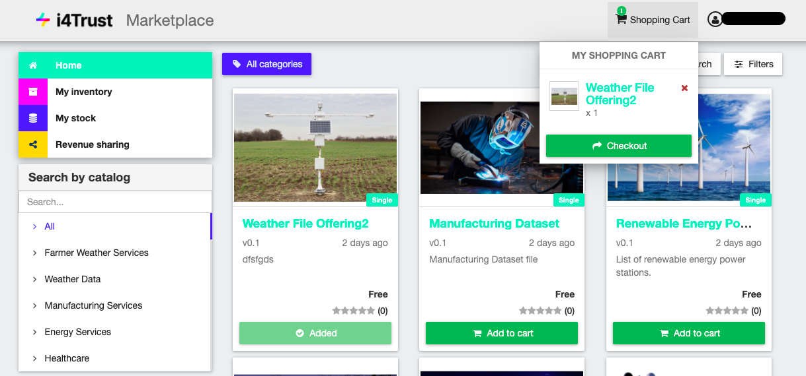

There you will be asked to enter a billing address even if the offering is free. After adding one, confirm your purchase by clicking “Checkout” again.

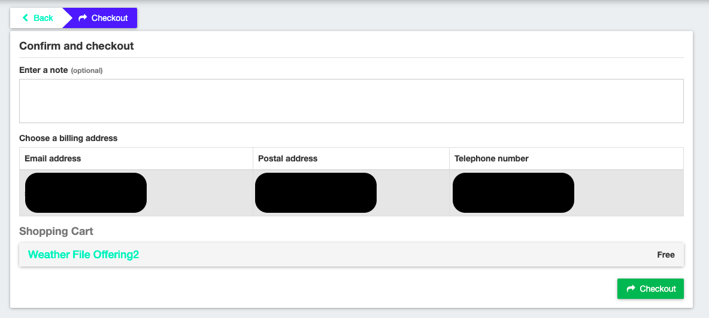

After receiving a confirmation message, your purchase will be visible to you under the tab “My inventory” on the left.

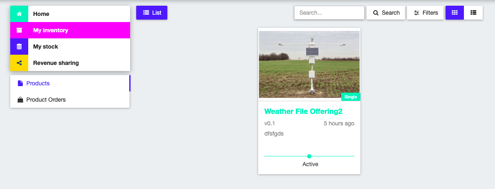

There you can click the Download button in the lower right corner and this will download the set.

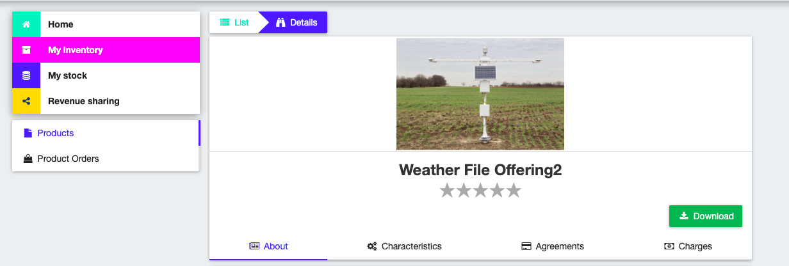

