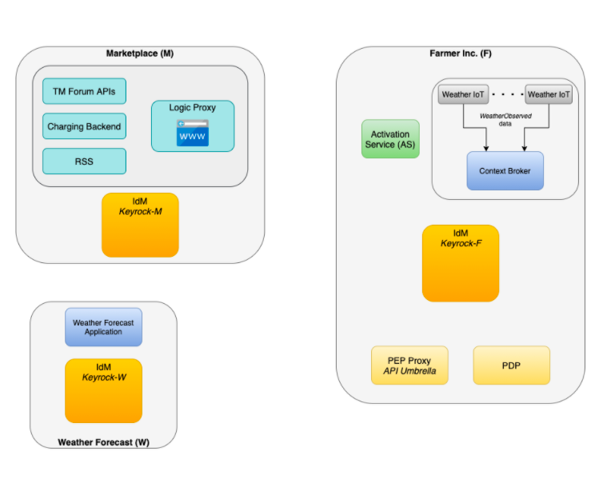
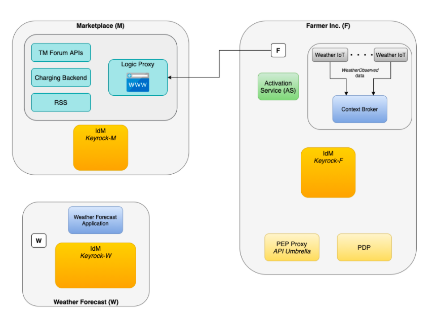
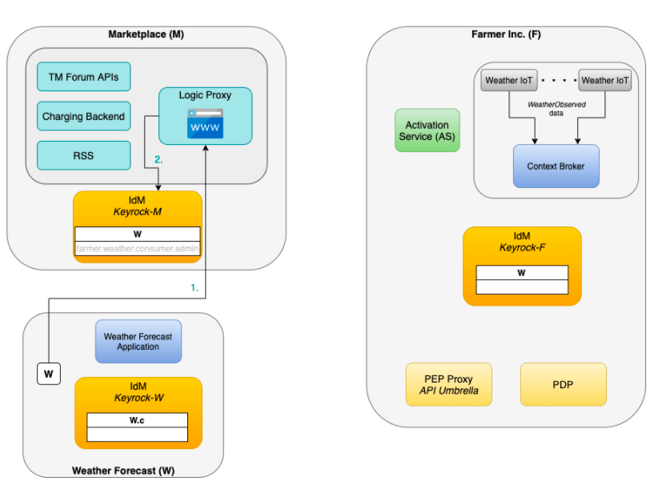
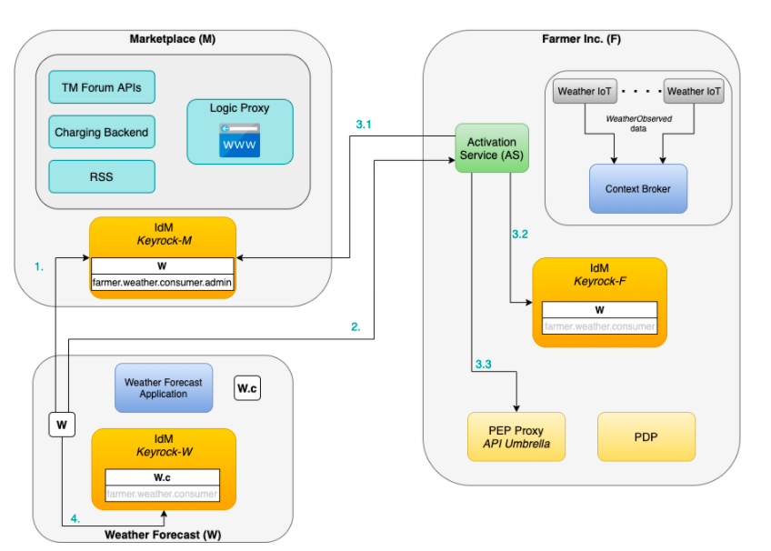
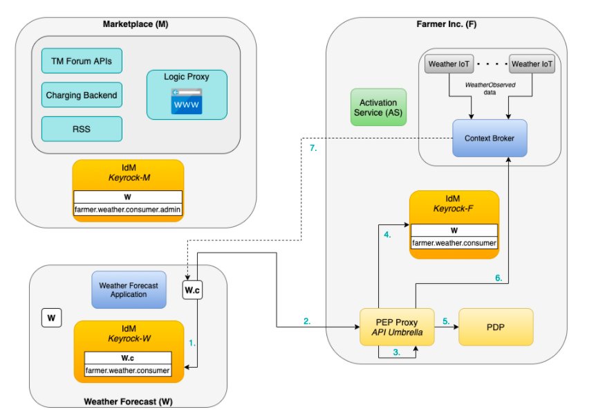

NGSI-LD based data service hosted at provider
==============================================

This use case depicts the usage guide for providing a NGSI-LD based data service hosted on the provider environment. The use case depicted consists of the following scenario.

“Farmer Inc.” owns land and operates several weather measurement stations on its parcels. Weather measurement data are stored as entity of type WeatherObserved on Context Broker. “Farmer Inc.” wants to monetise data and therefore offers data service on marketplace.

“Weather Forecast” is an AI service development company specialised on weather predictions. The company needs a large amount of weather measurement data in order to train its AI machine learning models. “Weather Forecast” wants to acquire access to weather measurement data service of “Farmer Inc.”

Architecture
-----------------
For these two parties to interact, they use the Marketplace which makes up the third party in the following architecture.

   Architecture of the NGSI-LD based Data Service

In the architecture of the figure above, three parties involved, each with their own IdM instance:

* Marketplace (in the following referred to as M)
* Farmer Inc. (in the following referred to as F)
* Weather Forecast (in the following referred to as W)

The lifecycle of the data service offered and consumed on the market place consists of the following steps:

#. Offer Creation: F creates offer on Marketplace M
#. Acquisition: W acquires access to offering in M 

  * → W gains right to activate service
#. Activation: W activates service at F

  * → W becomes trusted organisation at F
  * → W gains right to assign role farmer.weather.consumer to users and applications within its organization
#. Consumption: User of W consumes weather data of F

  * → Obtains token of Keyrock-W with farmer.weather.consumer
  * → Sends request to PEP Proxy of F

In the following two sections, the steps for both the seller and the customer are explaines. Please note that for the execution of theese steps, it is assumed that the executeing party has the following components as instances:

* `Context Broker <https://fiware-orion.readthedocs.io/en/master/admin/install/index.html>`_
* `Keyrock IdM <https://fiware-ai-marketplace-poc.readthedocs.io/en/dev/kubernetes-guide.html#idm>`_
* `API umbrella <https://github.com/apinf/apinf-umbrella>`_

Furthermore, the asset to be installed in the charging backend of the marketplace for this use case is a specific version (in a specific branch) of the 
`NGSILD Query plugin <https://github.com/Ficodes/bae-ngsild-query/tree/i4trust>`_ . 
For the plugin itself, please refer to the `Installing Asset Plugins <https://fiware-ai-marketplace-poc.readthedocs.io/en/dev/plugins-guide.html#installing-asset-plugins>`_ section.

Seller
-----------------
One more prerequisite that needs to be on the provider side (as depicted in the architecture diagram) would be the `activation service component <https://github.com/FIWARE-AI-Marketplace/bae-activation-service>`_.
F wants to create an offer for the weather measurement data service on Marketplace M. To do so, F opens the Marketplace M, creates a new offer and provides at least the following information:

* Service URL/Path
* Entity type (WeatherObserved)
* Acquisition role (farmer.weather.consumer)

   Seller F makes data service offering to Marketplace M

Customer
-----------------

As an initial step, Operator W wants to acquire access to offering of F. Therefore they execute the following steps displayed as numbered arrows in the next figure. 

#. Operator W acquires access on marketplace
#. Operator W gains role farmer.weather.consumer.admin in Keyrock-M which allows to assign the role farmer.weather.consumer to users and applications within its organization W

   Customer W acquires data service offering from Marketplace M

Afterwards, Operator W wants to activate access to offering of F which happanes in the following steps also displayed as arrows in the figure:

1. Operator W obtains access token from Keyrock-M
2. Operator W sends request to activation service of F with Token, Keyrock-W Public-Key/Secret, Role farmer.weather.consumer.admin
3. Activation process
 #. AS checks role in Keyrock-M
 #. AS assigns role farmer.weather.consumer to organization W in Keyrock-F
 #. AS stores Keyrock-W Public-Key/Secret
4. W assigns role farmer.role.weather to consumer user W.c in Keyrock-W

   Customer W activates data service offering from Marketplace M

As a last step, the Consumer W.c wants to access weather measurement data. This happens in the following steps, see figure: 

#. Consumer W.c gets JWT from Keyrock-W
#. W.c sends signed request with role farmer.weather.consumer to PEP Proxy of F to consume weather measurement data
#. PEP Proxy validates JWT (against known secret)
#. PEP Proxy checks role in Keyrock-F
#. PEP Proxy checks permission of role from PDP
#. PEP Proxy forwards request to Context Broker
#. Weather measurement data is returned to W.c

Optional: PEP Proxy logs access in Charging Backend of M

   Customer W consumes data service offering from Marketplace M
